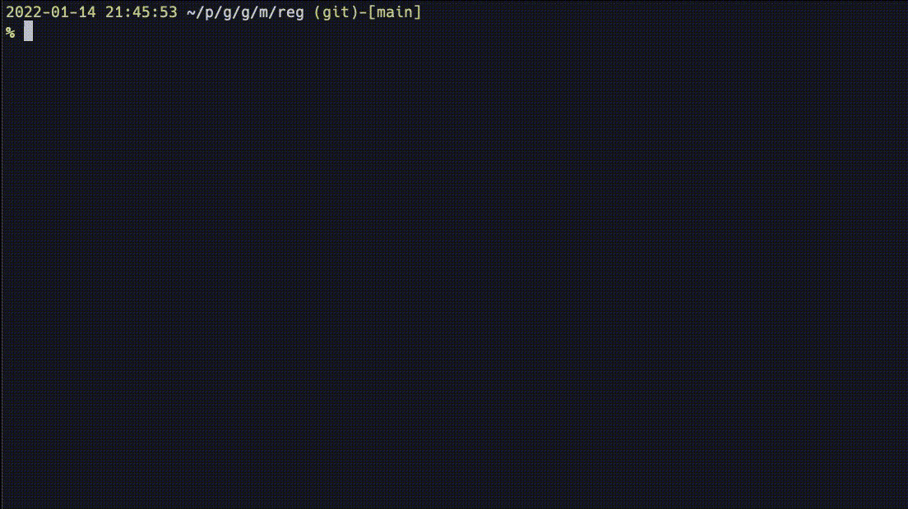

# reg

A CLI tool for re-run git command executed just before incorrectly.



## Installation

```shell
go install github.com/matsuyoshi30/reg
```

## Author

[matsuyoshi30](https://twitter.com/matsuyoshi30)
